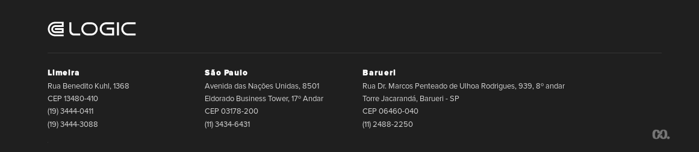

[About](../../About.md) :: [Aspectos Técnicos](../Aspectos-Tecnicos.md) :: [Migração Documentação VPP](Migracao-VPP.md)

#  Orientações para Migração de Documentação Legada do Visual Paradigm

**IMPORTANTE** Devem ser migrados apenas os artefatos documentados segundo os novos padrões de documentação. Artefatos legados fora do padrão devem ser descartados e criados inteiramente novos na Wiki.

## Artefatos Migrados via `copy` and `paste`

### Casos de Uso

1. Devem ser migrados apenas os **Casos de Uso** documentados segundo os novos padrões de documentação: Casos de uso sucintos, que representem as interações entre atores.
2. Com o Visual Paradigm e o Atom aberto, copiar e colar.
3. Realizar os ajustes necessários

### Regras de Negócios

## Entidades

1. Não serão migradas
2. Importar diretamente da base de dados para o Astah, vide: [Reverse BD no Astah](../Reverse-DB-Astah/Reverse-DB-Astah.md)

## Artefatos que não serão migrados

### Diagramas UML

1. Não são intercambeáveis.
2. Será necessário criar novamente no Astah

_[Voltar para Documentação do Software](../../.../ReadMe.md)_

