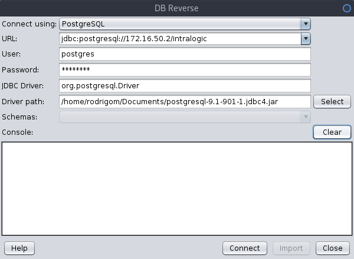
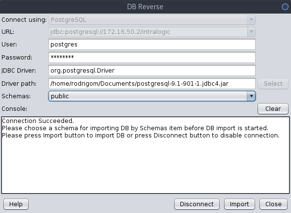
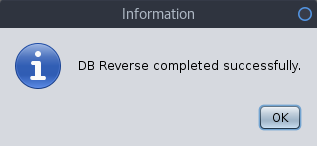
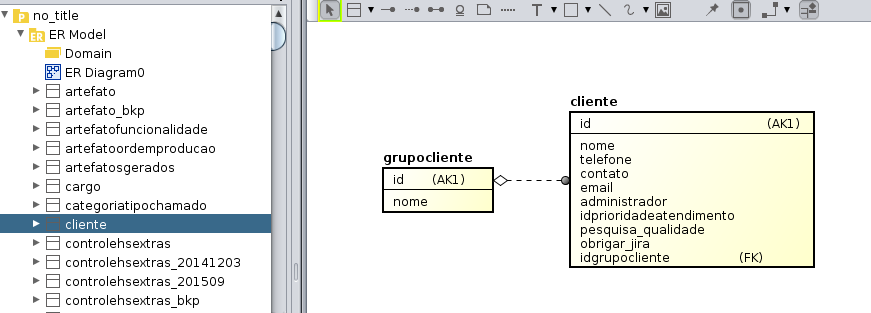

[About](../../About.md) :: [Aspectos Técnicos](../Aspectos-Tecnicos.md) :: [Reverse BD no Astah](Reverse-DB-Astah.md)

#  Procedimentos para Reversão (import) de Tabelas no Astah

1. Baixe o pĺugin http://astah.net/features/db-reverse-plugin
2. Siga as instruções da própria pagina
3.

## PoC realizada com base do Intralogic

Configure a conexão.
É necessário informar a localização do driver JDBC

Selecione o schema

Acione comando `import`

Crie um Diagrama ER e arraste as entidades:

_[Voltar para Documentação do Software](../../.../ReadMe.md)_

