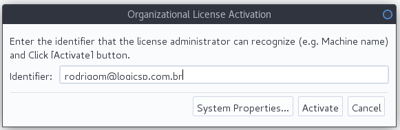
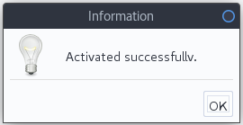

[About](../../About.md) :: [Aspectos Técnicos](../Aspectos-Tecnicos.md) :: [Setup Ambiente Astah](Setup-Ambiente-Astah.md)

#  Procedimentos para Setup de ambiente para criação/edição de diagramas usando Astah

## Instalar ferramenta case: Astah

_Procedimento necessário apenas se não foi possível a instalação automática._

1. Efetuar o download em: `http://astah.net/download`   _Nota: Baixar a opção trial 50 dias_
2. Instalar a ferramenta: `sudo dnf install astah-professional-7.1.0.f2c212-0.noarch.rpm`
3. Para abrir a ferramenta executar o comando: `astah-pro`

## Ativar Licença no Astah

1. Habilitar acesso a lib do astah:   `sudo chmod a+rw /usr/lib/astah_professional/ -R`
2. Acessar `Tools` -> `Licence...`
3. Informar o arquivo de licença: [Salvar link como...](http://172.16.50.2/svn/repositorioLogic/PDS/trunk/Templates/Licenca-Astah/astah_professional_license.xml)
4. Informe seu email da **Logic** em `Organizational Licence Activation` e selecionde `Activate`  
1. Você deverá receber a mensagem:   

_[Voltar para Documentação do Software](../../.../ReadMe.md)_

