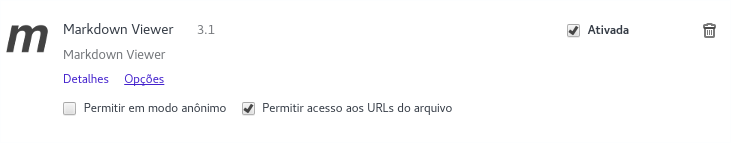
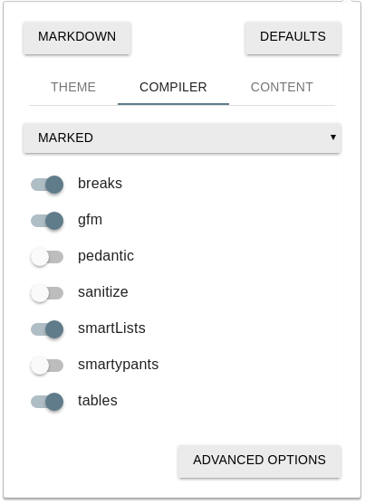

[About](../../About.md) :: [Aspectos Técnicos](../Aspectos-Tecnicos.md) :: [Setup Ambiente Atom/Markdown](Setup-Ambiente-Atom.md)

#  Procedimentos para Setup de ambiente para criação/edição de páginas `github markdown` usando Atom

## Instalar e Configurar a IDE Atom

1. Instalar a IDE Atom conforme orientação do TI-Interno (Rodrigo Rosa)
3. Instalar os pacotes opcionais:   _Para Instalar os pacotes adicionais pressione `ctrl+,` botão: `Install`_
  1. Language-Markdown
  2. Markdown-Writer
  2. Markdown-Preview-Plus
  3. Markdown-Scroll-Sync
  4. Markdown-Toc
  5. Tool-Bar
  6. Tool-Bar-Markdown-Writer

## Instalar e Configurar o plugin para Chrome

1. Instalar o plugin
2. Marcar a opção `Permitir Acesso as URLs do Arquivo`
3. Configure o plugin com as opções abaixo:

## Instalar e Configurar o plugin para Firefox

_(opcional, no chrome a visualização é melhor)_

1. Instalar o plugin modificado: [markdown-viewer@thiht.fr.xpi](Setup-Ambiente-Atom-Anexos/markdown-viewer@thiht.fr.xpi)
2. Reiniciar o firefox

_[Voltar para Documentação do Software](../../.../ReadMe.md)_

