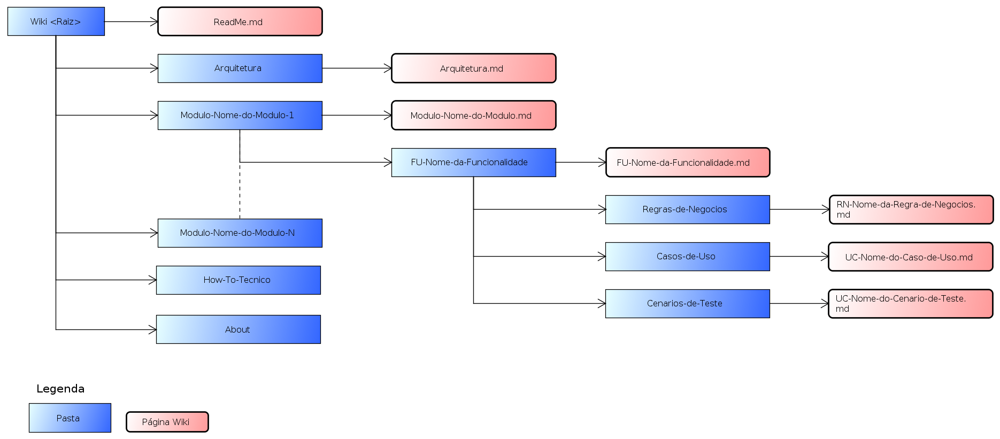

[About](../About.md) :: [Organizacao-Fisica](Organizacao-Fisica.md)

# Esquema Físico da Documentação

**IMPORTANTE:** Esta estrutura de pastas e arquivos é Fixa e não pode ser alterada.

  - [ReadMe](Organizacao-Fisica/ReadMe.md)
  - [Arquitetura](Organizacao-Fisica/Arquitetura.md)
  - [Módulos](Organizacao-Fisica/Modulo.md)
  - [Funcinalidades](Organizacao-Fisica/Funcionalidade.md)

---

_[Voltar para Documentação do Software](../../ReadMe.md)_

