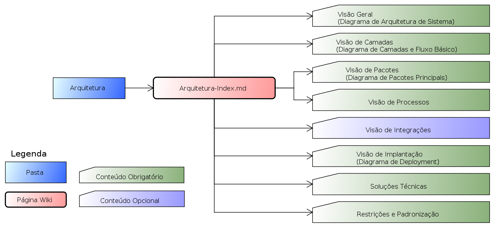

[About](../../About.md) :: [Organização Física](../Organizacao-Fisica.md) :: [Arquitetura](Arquitetura.md)

 [Voltar para Home](../../../ReadMe.md) 

# Arquitetura

| Pasta/Artefato                           | Conteúdo                                                                                                       |
|------------------------------------------|----------------------------------------------------------------------------------------------------------------|
| **Arquitetura-ReadMe.md**  | Página inicial da arquitetura, com links para todo o conteúdo  |
| (Conteúdo) **Arquitetura-Geral.md**  | Página com a Visão Geral da Aquitetura  |
| (Anexo) **UML-Arquitetura-Sistema.asta**  | Diagrama com a arquitetura de sistema (visão macro do produto e seus relacionamentos com sistemas ou dispositivos externos)  |
| (Conteúdo) **Camadas.md**  | Página com a visão de camadas e seu fluxo básico  |
| (Anexo) **UML-Arquitetura-Camadas.asta**  | Diagrama de camadas da arquitetura  |
| (Anexo) **UML-Arquitetura-Fluxo-Basico.asta**  | Diagrama de sequência do fluxo básico de comunicação entre camadas |
| (Conteúdo) **Pacotes.md**  | Página com a visão de pacotes do código fonte  |
| (Anexo) **UML-Arquitetura-Pacotes.asta**  | Diagrama de pacotes |
| (Conteúdo) **Processos.md**  | Página com a visão de processos do software |
| (Conteúdo) **Integracao.md**  | Página com a visão das integrações com outros sistemas |
| (Conteúdo) **Implantacao.md**  | Página com a visão do empacotamento para deploy e as características da implantação |
| (Conteúdo) **Solucoes-Tecnicas.md**  | Página com as soluções técnicas e frameworks de cada camada e testes |
| (Conteúdo) **Restricoes-Padroes.md**  | Página com as restrições técnicas da aquitetura e sua padronização |

Notas:
1.  Os artefatos estão marcados em **negrito**
2.  As pastas em texto plano
