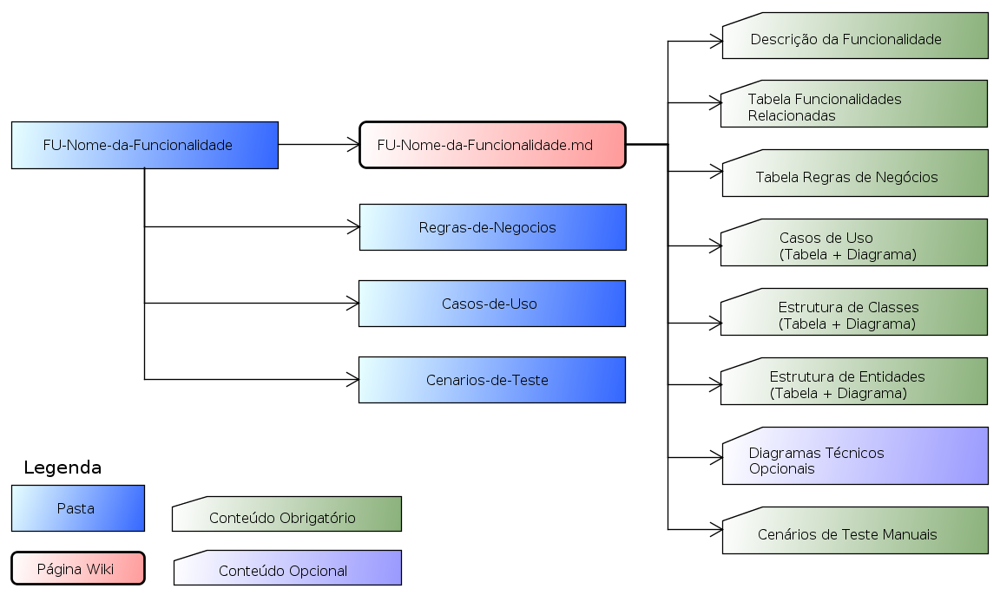

  
  

[About](../../About.md) :: [Organização Física](../Organizacao-Fisica.md) :: [Funcionalidade](Funcionalidade.md)

 [Voltar para Home](../../../ReadMe.md) 

# Funcionalidade

| Pasta/Artefato                         | Conteúdo                                                                                                                                                                                                                   |
|----------------------------------------|----------------------------------------------------------------------------------------------------------------------------------------------------------------------------------------------------------------------------|
| **FU-Nome-da-Funcionalidade.md**     | Página de documentação de uma funcionalidade , com links para as funcionalidade relacionadas e para todos os artefatos que a implementam no sistema: Casos de Uso, Cenários de Teste, Regras de Negócios,Diagramas, Etc |
| Regras-de-Negocios                     | Pasta com todas as paginas de Regras de Negócios da funcionalidade onde este está inserido                                                                                                                                 |
| Casos-de-Uso                           | Pasta com todos os casos de uso da funcionalidade onde este está inserido                                                                                                                                                  |
| Cenarios-de-Teste                      | Pasta com todas as paginas de cenário de teste manuais da funcionalidade onde este está inserido                                                                                                                           |
| FU-Nome-da-Funcionalidade-Anexos | Pasta para armazenar os anexos (incluindo diagramas) da pagina **FU-Nome-da-Funcionalidade.md**                                                                                                                          |

Conteúdo das Sub-pastas:

| Sub-Pasta          | Artefato                            | Conteúdo                                                                                                                             |
|--------------------|-------------------------------------|--------------------------------------------------------------------------------------------------------------------------------------|
| Casos-de-Uso       | **UC-Nome-do-Caso-de-Uso.md**       | Página de documentação de um caso de uso, com link para a funcionalidade relacionada e para todos os artefatos dos quais ele depente |
| Cenarios-de-Teste  | **TC-Nome-do-Cenario-de-Testes**    | Página de documentação de um cenário de teste manual _(o quê testar)_ com o caso de teste que o exercita _(como testar)_              |
| Regras-de-Negocios | **RN-Nome-da-Regra-de-Negocios.md** | Página de documentação de uma regra de negócios da funcionalidade                                                                    |

Notas:
1.  Os artefatos estão marcados em **negrito**
2.  As pastas em texto plano
