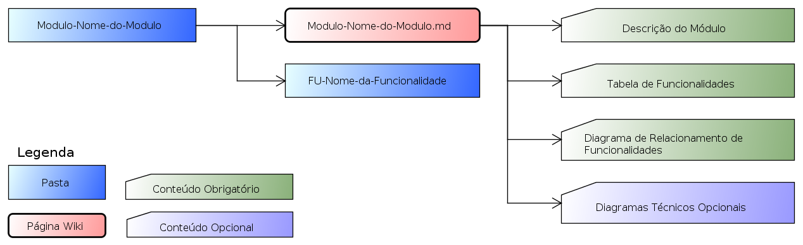

  
  

[About](../../About.md) :: [Organização Física](../Organizacao-Fisica.md) :: [Módulo](Modulo.md)

 [Voltar para Home](../../../ReadMe.md) 

# Módulo

| Pasta/Artefato                                        | Conteúdo                                                                                        |
|-------------------------------------------------------|-------------------------------------------------------------------------------------------------|
| **Modulo-Nome-do-Modulo.md**                        | Página inicial de um módulo e a lista de suas funcionalidas e seus relacionametos               |
| (Anexo) **UML-Funcionalidades-Nome-do-Modulo.asta** | Diagrama das Funcionalidades do Módulo e seus Relacionamentos                                   |
| FU-Nome-da-Funcionalidade                             | N-Pastas, uma para cada funcionalidade do módulo, com toda documentação de cada funcionalidade. |
| Modulo-Nome-do-Modulo-Anexos                        | Pasta para armazenar os anexos (incluindo diagramas) da pagina **Modulo-Nome-do-Modulo.md**   |

Notas:
1.  Os artefatos estão marcados em **negrito**
2.  As pastas em texto plano
