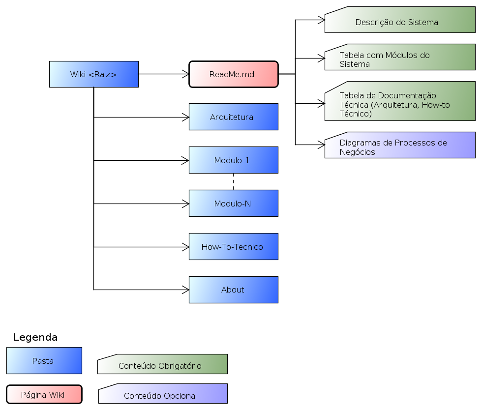

  

[About](../../About.md) :: [Organização Física](../Organizacao-Fisica.md) :: [ReadMe](ReadMe.md)

 [Voltar para Home](../../../ReadMe.md) 

# ReadMe

| Pasta/Artefato        | Conteúdo                                                                                                                        |
|-----------------------|---------------------------------------------------------------------------------------------------------------------------------|
| **ReadMe.md**         | Página inicial da documentação do produto de software, com links para todo o conteúdo                                           |
| Arquitetura           | Pasta com todos os Artefatos de documentação da arquitetura do software                                                         |
| Modulo-Nome-do-Modulo | N-Pastas, uma para cada módulo, com toda documentação do módulo                                                                 |
| PDS                   | Pasta com artefatos do processo de desenvolvimento de software da Logic para apoio no entendimento e manutenção da documentação |
| How-to-Tecnico        | Pasta com páginas de instruções técnicas necessárias a implantação, configuração de ferramentas, etc                            |
| ReadMe-Anexos     | Pasta para armazenar os anexos da pagina **ReadMe.md**                                                                          |

Notas:
1.  Os artefatos estão marcados em **negrito**
2.  As pastas em texto plano
