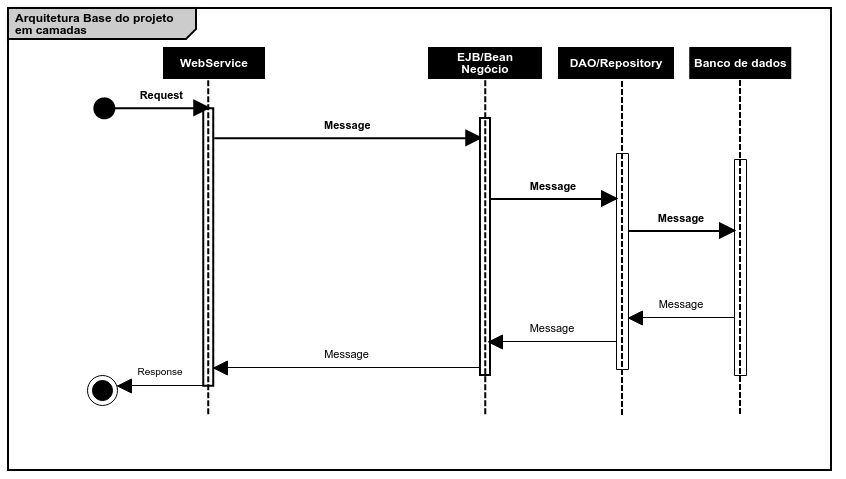
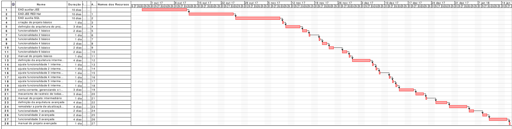
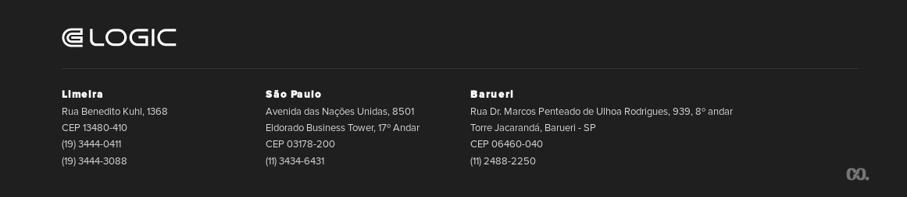

[Home](../../ReadMe.md) :: [How-to Técnico](../How-To-Tecnico.md) :: [Intruções Trilha JEE-SQL](Intrucoes-Trilha-JEE-SQL.md)

# Instruções para realização dos exercícios

## Objetivo

Este documento tem como objetivo a definição de uma estratégia para a evolução tecnológica nos conceitos de JEE e SQL dos colaboradores da Logic.

_Para definição da estratégia os seguintes pontos são importantes:_

## Metodologia

1. será fornecido material de apoio, junto com um curso a distância que devem ser utilizado como base de conhecimento
2. após a conclusão dos estudos do material de apoio e cursos complementares o colaborador deverá executar avaliação prática

## Material

1. o material a ser utilizado para o treinamento em JEE, será o oficial disponibilizado pelo próprio site da Oracle, o qual se encontra em: https://docs.oracle.com/javaee/7/JEETT.pdf
2. EAD auxiliar JEE: https://www.alura.com.br/carreira-desenvolvedor-java-web-enterprise
3. EAD auxiliar JEE: trilha da Red Hat Delivery Specialist - Middleware Application Development MWS-DEL-APD-13849-CUR-EN_US
4. o material a ser utilizado para o treinamento em SQL será o disponibilizado pelo site: https://www.w3schools.com/sql/default.asp
5. EAD auxiliar SQL: https://www.alura.com.br/carreira-iniciando-com-sql-e-mysql
6. outras fontes que sejam de interesse do participante podem ser utilizadas

## Avaliações:
1. por não conter framework de interface nesta trilha, todas as funcionalidades devem possuir webservices(REST, Servlet e/ou SOAP) para a realização de chamadas e a validação
2. é necessário a criação de um manual detalhado de instalação, configuração e utilização do pacote do projeto. Utilize para isto a seção "How-to Técnico" da wiki.
3. não é permitido que sejam feitos projetos em grupos de colaboradores
4. o banco de dados que deve ser utilizado é HSQLDB
5. arquitetura geral do projeto. o projeto deve seguir a arquitetura especificada abaixo:

Considerando o diagrama acima, o projeto, deve ser dividido em no mínimo 3 camadas sendo:
1. webService: camada responsável pelo recebimento das chamadas realizadas
2. EJB: camada de negócio aonde as validações de entrada, obtenção de objetos e tratativas de negócio devem ser efetuadas
3. DAO/Repository: camada responsável pelo acesso ao modelo relacional e dados do produto

### Avaliação Básica:

Criar um projeto que possua as seguintes características(utilizar empacotamento ejb + war + ear):

1. arquitetura: WebService -> EJB -> JDBC
  1. utilizar Session Beans Stateless
  1. considere uma arquitetura utilizando DAO/Repository(utilize CDI para injeção)
1. funcionalidades:
  1. Lançamento Contas Mensais
    1. lançamento de contas do mês(nome, data, valor, tipo do lançamento(NORMALIZADO)), considere validações dos campos
    1. alteração de lançamentos, considere validações dos campos
    1. exclusão de lançamentos, considere validações dos campos
  2. Consulta Lançamentos
    1. pesquisa de lançamentos por período de tempo (dia/mês/ano), considere validações dos campos
    1. pesquisa de lançamentos por parte do nome do lançamento, considere validações dos campos
    1. pesquisa por tipo de lançamento, considere validações dos campos
1. testes automatizados
  1. manual de utilização/implantação

### Avaliação Intermediária:

Modificar o projeto básico adicionando as seguintes características:
1. arquitetura: WebService -> EJB -> Hibernate
  1. remodelar a aplicação de forma a utilizar o Hibernate para persistência
2. funcionalidades adicionais:
  1. conta corrente, gerenciando o total de gastos ( conta corrente como banco) - utilizar mecanismo de Events CDI para atualizar os valores da conta corrente
  1. mecanismo de rastreio de todas os lançamentos que alteraram a conta corrente
    1. este log não precisa ser feito em banco de dados (utilize cache)
    1. o local de log deve ser único(utilize singleton session bean)
3. testes automatizados
1. manual de utilização/implantação

### Avaliação Avançada:

Modificar o projeto intermediário adicionando/modificando as seguintes funcionalidades:
1. arquitetura: WebService -> EJB/JMS -> Hibernate
  1. remodelar a parte de atualização de valor total da conta corrente para utilização de JMS e MDB(Message driver bean)
2. funcionalidades adicionais:
  1. criar um timer que a cada 10 minutos irá pegar todos os lançamentos no mecanismo de rastreio e imprimir todas as informações do console do servidor(utilize o conceito de schedule)
  2. utilizando filtros/interceptors criar um mecanismo de segurança para aplicação, o usuário e senha admin/admin123 deve ser válidos
  3. crie uma pequena interface em HTML+Javascript que utilizando o conceito de websocket, mostre a cada novo rastreio uma notificação no navegador
3. testes automatizados
4. manual de utilização/implantação

## Entrega, monitoramento/acompanhamento e avaliação do treinamento

1. ao início da parte prática do treinamento o colaborador deve criar um usuário e um novo repositório no https://www.github.com
2. a cada semana será realizado um acompanhamento do executado VS esperado do treinamento, seguindo o definido cronograma(reunião de 30 minutos)
3. ao final do projeto uma apresentação sobre o projeto prática deve ser realizada, considerando:
  1. arquitetura utilizada
  2. padrões utilizados
  3. resumo do funcionamento do projetos
  4. outros aspectos que o colaborador considerar importantes
4. durante o processo de treinamento/avaliação os problemas/dúvidas podem ser direcionados, a qualquer momento, ao responsável elencado para acompanhamento

## Cronograma de entregas/prazos

O prazo total para entrega do projeto são de 3 meses, sendo que deste 3 meses as seguintes etapas devem ser cumpridas:

**Estudo das tecnologias: primeiro mês**
  1. EAD auxiliar JEE – 10 dias
  2. EAD JEE RED Hat – 10 dias
  3. EAD auxilia SQL – 10 dias
  4. *Leitura do material – paralelo ao primeiro mês

**Desenvolvimento projetos: 2 meses**
1. projeto básico – 15 dias
  1. criação do projeto básico – 1 dia
  2. definição da arquitetura do projeto básico – 3 dias
  3. funcionalidade 1 básico – 2 dias
  4. funcionalidade 2 básico – 1 dia
  5. funcionalidade 3 básico – 1 dia
  6. funcionalidade 4 básico – 2 dias
  7. funcionalidade 5 básico – 2 dias
  8. funcionalidade 6 básico – 2 dias
  9. manual do projeto básico – 1 dia
2. projeto intermediário – 17 dias
  1. definição da arquitetura intermediário – 4 dias
  2. ajuste funcionalidade 1 intermediário – 1 dia
  3. ajuste funcionalidade 2 intermediário – 1 dia
  4. ajuste funcionalidade 3 intermediário – 1 dia
  5. ajuste funcionalidade 4 intermediário – 1 dia
  6. ajuste funcionalidade 5 intermediário – 1 dia
  7. ajuste funcionalidade 6 intermediário – 1 dia
  8. conta corrente, gerenciando o total de gastos – 3 dias
  9. mecanismo de rastreio de todas os lançamentos que alteraram a conta corrente – 3 dias
  3. manual do projeto intermediário – 1 dia
3. projeto avançado – 17 dias
  1. definição da arquitetura avançada – 4 dias
  2. remodelar a parte de atualização de valor total da conta corrente para utilização de JMS e MDB – 4 dias
  3. funcionalidade 1 avançada – 2 dias
  4. funcionalidade 2 avançada – 2 dias
  5. funcionalidade 3 avançada – 4 dias
  6. manual do projeto avançada – 1 dia

**Expectativa de cronograma:**

_[Sobre o Portal de Documentação](../../About/About.md)_

